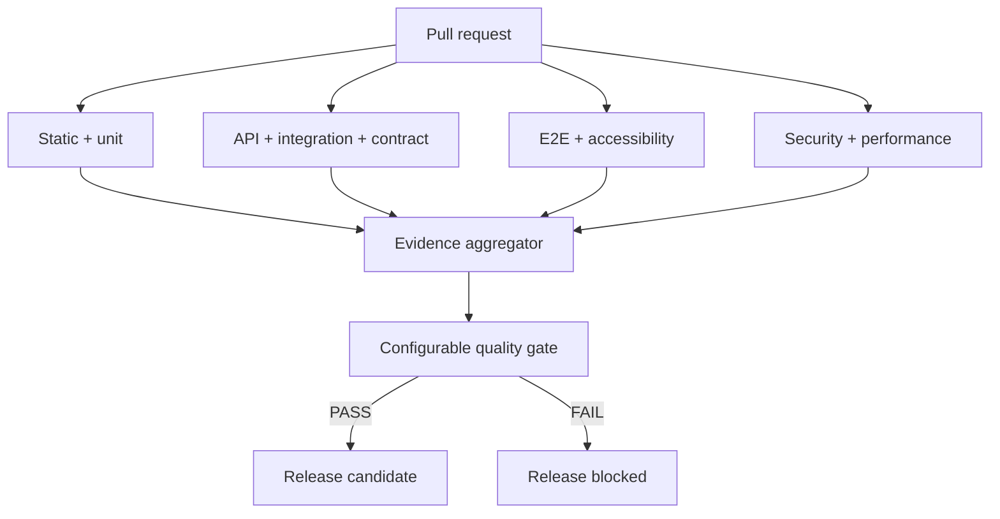

# Continuous Quality Engineering

A production-style reference implementation demonstrating how modern engineering teams continuously evaluate code quality, functional correctness, API behaviour, accessibility, security, performance, and release readiness through automated CI/CD quality gates.

[](https://nodejs.org/)
[](https://playwright.dev/)
[](docs/quality-gates.md)
[](LICENSE)

## The business problem

Passing unit tests is not a release decision. Delivery teams need fast feedback on pull requests and deeper evidence for release candidates without hiding security findings, performance regressions, accessibility defects, missing reports, or flaky recoveries. This repository turns those independent signals into a transparent, configurable recommendation: `PASS`, `CONDITIONAL_PASS`, or `FAIL`.

It positions quality as an automated, measurable property of the delivery pipeline—not a testing phase at the end.

## What this demonstrates

- Fastify/TypeScript demo service with a lightweight web UI and real SQLite persistence
- Vitest unit tests, Playwright API/integration/E2E tests, and Pact consumer contracts
- Axe accessibility analysis and k6 smoke/load/spike profiles
- npm audit, Gitleaks, Trivy, OWASP ZAP, and CodeQL integration
- Normalized evidence, explicit missing-report handling, configurable gates, and a weighted quality score
- Pull-request, nightly, security, performance, and release GitHub Actions workflows
- Risk-based change impact, retry visibility, artifact retention, and release governance
- Docker reproducibility, non-root runtime, health checks, and environment-aware configuration

This is deliberately a small application wrapped in a mature quality system. The portfolio message is: **this engineer can design quality into a delivery platform, not merely automate test cases.**

## Architecture



See [architecture](docs/architecture.md) for component boundaries and evidence flow.

## Technology stack

| Concern               | Technology                                                   |
| --------------------- | ------------------------------------------------------------ |
| Demo application      | Node.js 22, TypeScript, Fastify, built-in `node:sqlite`      |
| Unit and engine tests | Vitest + V8 coverage                                         |
| API, integration, UI  | Playwright                                                   |
| Contract              | Pact                                                         |
| Accessibility         | Axe with Playwright                                          |
| Performance           | k6                                                           |
| Security              | npm audit, Gitleaks, Trivy, OWASP ZAP, CodeQL                |
| Pipeline              | GitHub Actions; Jenkins and Azure DevOps mappings documented |
| Reproducibility       | Docker and Docker Compose                                    |

## Repository map

```text
demo-app/          Acme Order Service and unit tests
tests/             API, integration, contract, E2E, accessibility, k6
quality/           Policy, normalized model, scoring and release gate
scripts/           Aggregation, reporting, impact and pipeline validation
security/          Gitleaks, Trivy and ZAP configuration
.github/workflows/ PR, nightly, security, performance and release controls
docs/              Strategy, governance and interview material
quality-history/   Clearly labelled demonstration trend fixtures
```

## Quality model

Every tool remains authoritative for its own execution. `scripts/aggregate-results.ts` parses its machine-readable result into a common model; absence is recorded in `missingReports` and fails closed when the report is mandatory. The gate never treats “job did not run” as zero findings.

Default hard gates include:

- Unit/API/integration/contract pass rate: 100%
- Line coverage: at least 80%
- Critical E2E pass rate: 100%; overall E2E: at least 98%
- Critical/serious Axe violations: 0
- Critical/high vulnerabilities and detected secrets: 0
- k6 p95: at most 1,000 ms; error rate: at most 1%
- Critical flaky tests: 0

Policy lives in [`quality/config/quality-gates.json`](quality/config/quality-gates.json), not in the decision code. The faster PR profile omits the scheduled ZAP evidence requirement but keeps all other hard gates.

## Transparent quality score

The score complements hard gates; it cannot overrule one. Default weights are code quality 10%, functional 30%, E2E 20%, security 20%, performance 10%, and accessibility 10%. Each component is calculated deterministically from measured coverage, pass rates, finding counts, and k6 metrics. The exact formula is in [quality gates](docs/quality-gates.md).

## Demo application

The Acme Order Service supports:

```text
GET  /health
POST /api/login
GET  /api/products
POST /api/orders
GET  /api/orders/:id
```

The documented local demo account is `customer@acme.test` / `Order123!`. It is non-production fixture data, not a secret. Orders are validated, priced from the catalogue, authorized, and persisted in SQLite.

## Getting started

Prerequisites: Node.js 22 and npm 10+. Playwright browsers are needed for UI and accessibility checks. Docker, k6, Gitleaks, Trivy, and ZAP are needed only for their respective local checks; CI provisions them.

```bash
npm ci
npx playwright install --with-deps chromium
npm run quality
```

Start the application separately when exploring it:

```bash
npm run app:start
```

Open `http://127.0.0.1:3000`. Playwright commands automatically start an isolated in-memory instance.

## Running test layers

```bash
npm run test:unit
npm run test:api
npm run test:integration
npm run test:contract
npm run test:e2e
npm run test:accessibility
k6 run tests/performance/smoke.js
```

The portfolio is intentionally balanced: domain-level unit coverage, 13 API cases, five real integration paths, three consumer contracts, five critical-workflow E2E cases, two key-page accessibility scans, and three performance profiles. E2E does not duplicate every API validation.

## Generate and enforce the release decision

Security and performance tools must first produce their real JSON evidence in `reports/raw`. Then run:

```bash
npm run quality:aggregate
npm run quality:report
npm run quality:gate
```

Outputs:

- `reports/quality/normalized-results.json`
- `reports/quality/quality-report.json`
- `reports/quality/quality-report.html`
- `reports/quality/gate-evaluation.json`

The gate exits `1` for a product-quality failure and `2` for a gate infrastructure/configuration failure.

## Controlled failure demonstrations

`quality/fixtures/healthy.json` is a labelled test fixture. Engine unit tests clone it to demonstrate coverage, security, accessibility, performance, missing-evidence, warning-only, and compound failures without leaving `main` broken:

```bash
npm run quality:negative
npm run quality:gate -- --results quality/fixtures/healthy.json
```

## CI/CD workflows

- **PR Quality:** parallel static/unit, service-layer, E2E, non-functional, and security jobs; one final evidence gate; newer commits cancel older PR runs.
- **Nightly Regression:** cross-browser functional regression plus reusable security and performance workflows.
- **Security Quality:** dependency, secret, source/image, DAST, and CodeQL analysis.
- **Performance Quality:** selectable smoke/load profile.
- **Release Quality:** full evidence, release report, and hard decision for tags, release branches, or manual runs.

Required checks are branch-protection ready. Recommended repository settings are documented rather than silently changed. See [CI/CD](docs/ci-cd.md).

## Docker

```bash
docker compose build
docker compose up -d
docker compose ps
curl http://127.0.0.1:3000/health
docker compose down -v
```

The image compiles TypeScript in a build stage, installs only runtime dependencies in the final image, runs as a non-root user, persists SQLite data in a named volume, and exposes a real health check.

## Risk-based execution and impact

`npm run impact -- <base-sha>` maps changed paths to a deterministic risk and suite set. Backend, UI, auth/security, dependency, and documentation changes receive different treatment. It is a demonstrator, not a substitute for an enterprise service map. See [continuous quality strategy](docs/continuous-quality-strategy.md).

## Failure and flaky-test governance

Application assertions, infrastructure availability, and missing evidence are separate classifications. Playwright retries are visible: a fail-then-pass result is recorded as flaky, and a critical flake blocks the default policy. Retries do not turn unstable behaviour into an invisible green result.

## Security, accessibility, and performance

No individual scan proves that software is secure, accessible, or performant. The pipeline layers SCA, secret scanning, container/source analysis, DAST, automated WCAG checks, and workload-specific k6 thresholds while documenting manual and specialist testing that remains necessary:

- [Security testing](docs/security-testing.md)
- [Accessibility](docs/accessibility.md)
- [Performance testing](docs/performance-testing.md)

## Release governance

Automated `PASS` is a prerequisite, not an automatic production deployment. Protected environments may require human approval, risk acceptance, change evidence, and a rollback decision. Exceptions must be owned, time-bound, and auditable. See [release governance](docs/release-governance.md).

## Design decisions and limitations

- A monolithic demo keeps the focus on quality architecture; production microservices need federated ownership and service maps.
- Node's built-in SQLite makes local runs deterministic without native add-ons; production deployments would use managed PostgreSQL and migrations.
- In-memory sessions suit a demo, not horizontal production scaling.
- Automated Axe and ZAP checks complement, but do not replace, expert manual assessment.
- Sample trend history is labelled demonstration data; it is not represented as production history.
- GitHub-hosted runners can vary, so performance release baselines should ultimately use controlled runners.

## Roadmap

- Provider-side Pact verification and broker can-i-deploy checks
- OpenTelemetry export to Prometheus/Grafana
- Kubernetes deployment health and progressive-delivery gates
- Enterprise service-map-driven impact selection
- Signed provenance/SBOM policy and time-bound exception registry

## Interview walkthrough

Use the concise [interview walkthrough](docs/interview-walkthrough.md) to explain the demo application, parallel feedback, result normalization, hard gates, score, evidence report, and governance in two or five minutes.

The exact checks executed for this delivery, including environment-limited items, are recorded in the [validation report](docs/validation-report.md).

## Contributing

See [CONTRIBUTING.md](CONTRIBUTING.md). Changes to policy or suppressions require the same review discipline as production code.

## License

[MIT](LICENSE)
