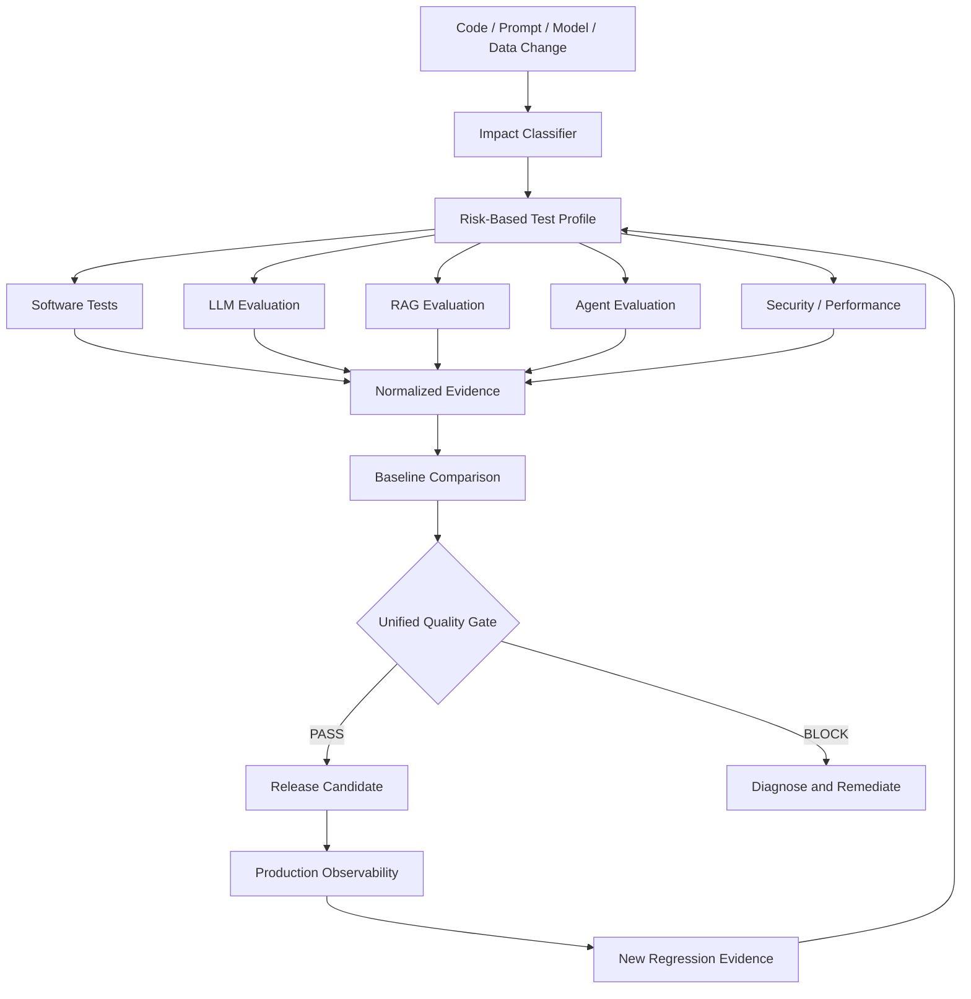

# Continuous AI Quality Engineering

## Integrating LLM, RAG and Agent Evaluation into CI/CD Quality Gates

**Technical White Paper — Version 1.0**  
**September 2026**

**Author:** Ashok Kumar Manohar  
**GitHub:** [ashokmanohar-ai](https://github.com/ashokmanohar-ai)  
**Primary reference implementation:** [Continuous Quality Engineering](https://github.com/ashokmanohar-ai/continuous-quality-engineering)  
**Supporting AI evaluation implementations:** [LLM Quality Evaluation Harness](https://github.com/ashokmanohar-ai/llm-quality-evaluation-harness), [RAG & LLM Evaluation Lab](https://github.com/ashokmanohar-ai/rag-llm-evaluation-lab), [AI Agent Evaluation Framework](https://github.com/ashokmanohar-ai/ai-agent-evaluation-framework), and [Enterprise AI Quality Engineering Platform](https://github.com/ashokmanohar-ai/enterprise-ai-quality-engineering-platform)

> **Publication note:** This is an independent technical white paper supported by open-source reference implementations. It is not a peer-reviewed academic publication, legal opinion, compliance certification, security certification, or statement of production readiness. Production adoption requires environment-specific engineering, model-risk, security, privacy and governance review.

---

## Abstract

Generative AI has introduced a new class of release risk into modern software delivery. Traditional CI/CD pipelines are effective at testing deterministic code, APIs, contracts, user interfaces, accessibility, security and performance, but they are not sufficient for systems whose behavior also depends on large language models, retrieval pipelines, prompts, embeddings, autonomous agents, tool selection, model versions and probabilistic outputs.

This white paper presents **Continuous AI Quality Engineering (Continuous AI QE)** as an operating model for integrating LLM, RAG and AI-agent evaluation directly into CI/CD quality gates. The goal is not to replace conventional software testing. It is to extend the delivery control plane so that every meaningful AI-system change produces measurable, explainable and reviewable quality evidence before release.

The framework separates **deterministic software quality**, **probabilistic AI quality**, **security and governance controls**, and **operational quality** while combining their evidence into one release decision. It advocates versioned evaluation datasets, deterministic-first checks, calibrated semantic judges, candidate-versus-baseline comparison, hard safety gates, risk-based test profiles, reproducible evidence, production-to-regression feedback loops and explicit handling of missing evidence.

The central proposition is:

> **An AI-enabled release should not be considered ready because its code compiled and its functional tests passed; it should be ready only when conventional software evidence and AI-specific evaluation evidence jointly satisfy an explicit, risk-calibrated quality policy.**

---

## 1. Executive Summary

AI-enabled applications combine two quality domains:

1. **Conventional software behavior** — code, APIs, contracts, user journeys, accessibility, dependencies, infrastructure and performance.
2. **AI behavior** — correctness, relevance, groundedness, retrieval quality, hallucination risk, refusal behavior, prompt robustness, structured-output validity, tool use, agent trajectories, model drift, token cost and stochastic stability.

Treating these domains as separate assurance programs creates blind spots. A pipeline can report green while an LLM has become less grounded. A RAG application can pass UI tests while retrieval recall has regressed. An agent can return a plausible final answer while using the wrong tool or bypassing approval. A security scan can pass while an indirect prompt-injection regression is reintroduced through retrieved content.

Continuous AI QE joins these signals into one controlled delivery model:

```text
Code / Prompt / Model / Data / Retrieval / Tool Change
                    ↓
             Change Impact
                    ↓
        Risk-Based Evaluation Profile
                    ↓
   Conventional Tests + AI Evaluations
                    ↓
      Normalize Evidence + Compare Baseline
                    ↓
        Hard Gates + Advisory Metrics
                    ↓
        PASS / CONDITIONAL / BLOCK
                    ↓
   Release + Observe + Feed Failures Back
```

The system should never interpret **not evaluated** as **passed**.

---

## 2. Why Traditional CI/CD Is Not Enough for AI Systems

Traditional CI assumes that deterministic assertions can describe most critical behavior. AI systems violate that assumption in several ways:

- equivalent correct responses may use different wording;
- model output can vary between runs;
- prompts and retrieval settings can regress without source-code changes;
- a model upgrade can alter safety and quality simultaneously;
- agent quality depends on tool selection and execution trajectory, not only text output;
- latency, token consumption and cost are part of product quality;
- retrieved content can introduce prompt injection or stale evidence;
- model-based judges introduce their own uncertainty.

Therefore, AI release engineering requires both **tests** and **evaluations**.

---

## 3. Continuous AI QE Quality Model

A practical release model can be expressed as:

\[
Q_{release}=Q_{software}+Q_{llm}+Q_{rag}+Q_{agent}+Q_{security}+Q_{performance}+Q_{governance}
\]

This formula is conceptual, not a weighted score. Critical failures must not be averaged away.

| Domain | Representative evidence |
|---|---|
| Software | Unit, API, contract, integration, E2E, accessibility |
| LLM | Correctness, relevance, completeness, refusal, structured output |
| RAG | Precision/recall, groundedness, citation integrity, freshness |
| Agent | Task completion, tools, arguments, trajectories, approvals, recovery |
| Security | Injection, disclosure, excessive agency, authorization, isolation |
| Performance | Latency, throughput, tokens, cost, reliability |
| Governance | Dataset/version provenance, approvals, exceptions, audit evidence |

---

## 4. The AI Quality Contract

Every AI-enabled feature should have a quality contract before it has a release gate.

The contract should define:

- intended tasks and user groups;
- critical failure conditions;
- approved data and knowledge sources;
- expected refusal behavior;
- structured-output requirements;
- security and privacy constraints;
- tool permissions and human-approval boundaries;
- latency and cost expectations;
- evaluation datasets;
- required metrics and thresholds;
- baseline and regression rules;
- environments and owners.

Without this contract, CI can measure many things but cannot make a defensible decision.

---

## 5. Versioned Evaluation Datasets

AI quality gates depend on datasets in the same way conventional tests depend on test cases.

Each case should have:

- stable identifier;
- user input;
- task/category;
- expected facts or expected behavior;
- approved context or sources where relevant;
- prohibited claims/actions;
- safety tags;
- severity/criticality;
- environment constraints;
- dataset version.

Datasets should evolve through review, not silently through prompt experimentation.

---

## 6. Change-Aware AI Test Selection

Not every pull request requires the same AI evaluation depth.

A change-impact engine should classify changes such as:

| Change | Required evaluation |
|---|---|
| UI-only change | Functional/E2E + smoke AI path |
| Prompt change | LLM regression + safety + key workflows |
| Model/deployment change | Full LLM/RAG/agent baseline comparison |
| Embedding change | Retrieval benchmark + RAG regression |
| Chunking/index change | Retrieval + citation + grounding |
| Tool schema change | Agent/MCP contract + trajectory tests |
| Authorization change | Security + tenant/isolation + approval tests |
| Evaluation-policy change | Meta-tests + policy review |

Risk-based profiles keep feedback fast without reducing critical coverage.

---

## 7. Deterministic-First Evaluation

Use deterministic assertions whenever the truth is structurally available.

Deterministic candidates include:

- JSON schema validity;
- required fields;
- exact tool names;
- tool arguments;
- tool execution order;
- approval sequence;
- citation existence;
- source IDs;
- forbidden tools;
- latency thresholds;
- token counts;
- access-control outcomes;
- required factual fields.

Do not ask an LLM judge to evaluate what code can prove exactly.

---

## 8. LLM Evaluation in CI/CD

A production LLM evaluation suite should typically include:

- correctness;
- relevance;
- completeness;
- groundedness where evidence exists;
- hallucination/unsupported claim rate;
- refusal quality;
- structured-output compliance;
- prompt-injection resilience;
- privacy/PII leakage checks;
- latency;
- token usage;
- estimated cost;
- repeated-run stability.

Critical safety and schema failures should be hard gates.

---

## 9. RAG Evaluation in CI/CD

RAG systems require stage-level testing.

### Retrieval
- Precision@K
- Recall@K
- Hit@K
- MRR
- NDCG

### Context
- sufficiency;
- redundancy;
- version/freshness;
- metadata/authorization filtering;
- token-budget behavior.

### Generation
- factual completeness;
- groundedness;
- hallucination;
- citation correctness;
- refusal when evidence is insufficient.

The pipeline should identify which stage regressed rather than reporting one generic RAG score.

---

## 10. AI Agent Evaluation in CI/CD

Agent evaluation must capture execution traces.

Test dimensions include:

- task completion;
- tool selection;
- argument correctness;
- mandatory/forbidden steps;
- trajectory order;
- state transitions;
- human approval;
- authorization boundaries;
- recovery and escalation;
- loop/retry control;
- memory isolation;
- final response grounding;
- latency and cost.

A good final answer must not compensate for a bad trajectory.

---

## 11. LLM-as-a-Judge in Delivery Pipelines

Model judges can help with semantic dimensions such as:

- tone;
- clarity;
- nuanced relevance;
- plan quality;
- semantic consistency.

But judge outputs should be treated as measurements with uncertainty.

Good practice includes:

- versioned judge prompts;
- fixed evaluator model/deployment;
- temperature control;
- structured output;
- timeout handling;
- calibration against human labels;
- periodic agreement checks;
- repeated judging for high-impact cases where justified.

A judge should not silently become the sole release authority.

---

## 12. Candidate-vs-Baseline Comparison

Absolute thresholds are necessary but not sufficient.

Every important AI change should compare the candidate against an approved baseline using the same:

- dataset;
- evaluator version;
- metric definitions;
- thresholds;
- model sampling controls;
- retrieval configuration where applicable.

The release decision should surface both absolute failures and meaningful regressions.

---

## 13. Hard Gates vs Advisory Metrics

### Hard gates
Examples:

- critical safety failure;
- PII leakage;
- unauthorized tool action;
- missing human approval;
- structured-output failure on a critical workflow;
- critical retrieval failure;
- missing mandatory evaluation evidence.

### Advisory metrics
Examples:

- small relevance decline;
- minor latency increase;
- token-cost growth below budget threshold;
- stylistic quality change.

A weighted score can summarize health, but it cannot override a hard gate.

---

## 14. Missing Evidence Must Fail Closed

One of the most important pipeline rules is:

> **No report is not the same as no defect.**

If a required suite does not run, the evidence aggregator must record it as missing. The release gate should fail or become conditional according to policy.

This applies to conventional test reports and AI evaluation reports equally.

---

## 15. Normalized Evidence Model

Specialist tools should retain their native reports, but the release decision benefits from a normalized evidence contract.

Example:

```json
{
  "test_id": "refund-rag-014",
  "domain": "rag",
  "metric": "faithfulness",
  "score": 0.93,
  "threshold": 0.85,
  "passed": true,
  "severity": "high",
  "dataset_version": "refund-policy-v4",
  "model": "candidate-deployment",
  "trace_id": "...",
  "reason": "All generated claims supported by approved context"
}
```

Normalization should preserve provenance, not flatten away important evidence.

---

## 16. Pull Request Quality Profile

PR gates should be fast enough to run frequently.

A typical PR profile may include:

- unit/API/contract tests;
- critical E2E workflows;
- static/security checks;
- small LLM golden-set subset;
- RAG retrieval smoke set;
- agent tool-contract tests;
- deterministic safety cases;
- schema/structured-output tests;
- changed-area regression pack.

The goal is **fast, high-signal blocking evidence**.

---

## 17. Nightly AI Quality Profile

Nightly evaluation can expand coverage:

- full golden datasets;
- repeated-run stability;
- wider prompt variants;
- retrieval benchmarks;
- broader agent trajectory datasets;
- scheduled security/adversarial regression;
- model comparison;
- cost and latency trend capture.

Nightly should produce durable evidence, not merely dashboards.

---

## 18. Release Quality Profile

A release profile should include all mandatory evidence:

- full conventional regression;
- LLM quality gates;
- RAG quality gates;
- agent/MCP gates;
- security regression;
- performance evidence;
- baseline comparison;
- exception status;
- rollback readiness;
- approval evidence where required.

The output should be one explicit release recommendation.

---

## 19. Security as a First-Class AI Quality Gate

AI security must be part of release quality, not a disconnected scan.

Relevant risk classes include:

- prompt injection;
- sensitive-information disclosure;
- insecure tool use;
- excessive agency;
- cross-user/tenant access;
- malicious retrieved content;
- unsafe output handling;
- supply-chain/model dependency risk.

Confirmed security failures should become permanent regression cases.

---

## 20. Human-in-the-Loop Release Controls

Automation should produce a recommendation, not erase accountability.

Human approval is appropriate for:

- high-risk production deployment;
- policy exceptions;
- threshold changes;
- major model/provider changes;
- significant safety regressions accepted temporarily;
- newly enabled high-impact agent tools.

Exceptions should include owner, justification, expiry and compensating control.

---

## 21. Prompt and Configuration Governance

Treat the following as release-controlled artifacts:

- system prompts;
- prompt templates;
- tool descriptions;
- retrieval settings;
- embedding models;
- reranking configuration;
- evaluator prompts;
- quality thresholds;
- model/deployment identifiers.

A prompt change can be as consequential as a code change.

---

## 22. Model Upgrade Governance

A model upgrade should trigger:

1. compatibility validation;
2. full approved evaluation dataset;
3. safety regression;
4. RAG/agent evaluation where applicable;
5. candidate-vs-baseline comparison;
6. latency/token/cost comparison;
7. rollout/rollback decision.

Never assume a newer model is automatically better for a specific product workload.

---

## 23. Cost as a Quality Signal

Token usage and inference cost affect scalability and business viability.

Track:

- input tokens;
- output tokens;
- retrieval/context size;
- tool-call count;
- retries;
- cost per successful task;
- cost regression versus baseline.

Cost optimization should not reduce critical correctness or safety coverage.

---

## 24. Performance and Reliability

AI performance quality includes:

- end-to-end latency;
- model latency;
- retrieval latency;
- tool-call latency;
- P95/P99;
- timeout rate;
- retry rate;
- concurrency behavior;
- provider failure behavior;
- graceful degradation.

Performance thresholds belong in the same release policy as quality thresholds.

---

## 25. Flaky and Stochastic Behavior

Traditional flaky tests and probabilistic AI instability are related but different.

A test that passes on retry after a deterministic UI failure is flaky. An LLM case that alternates between acceptable and unacceptable answers is behaviorally unstable.

Track both explicitly.

For AI systems, repeated runs can measure:

- pass-rate distribution;
- variance;
- worst-case failure rate;
- safety consistency;
- cost variability.

---

## 26. Observability and Traceability

Every evaluation should be traceable to:

- commit/branch;
- dataset version/hash;
- prompt version;
- model/deployment;
- embedding/retriever version;
- agent/tool version;
- evaluator version;
- thresholds;
- environment;
- timestamp;
- trace/evaluation run ID.

Operational traces should connect production failures back to evaluation cases.

---

## 27. Production-to-Regression Feedback Loop

A mature Continuous AI QE system follows this loop:

```text
Production signal
   ↓
Trace / incident analysis
   ↓
Sanitize and reproduce
   ↓
Create permanent evaluation case
   ↓
Fix prompt/model/code/data/tool
   ↓
Compare against baseline
   ↓
Gate and release
```

The regression case remains after the incident is closed.

---

## 28. CI/CD Reference Architecture



---

## 29. Reference Implementation Mapping

The open-source repositories supporting this white paper demonstrate complementary parts of the operating model.

### Continuous Quality Engineering

Demonstrates:

- layered conventional quality evidence;
- normalized aggregation;
- hard gates;
- missing-report handling;
- weighted score that cannot override blockers;
- change-impact analysis;
- flaky-test governance;
- PR/nightly/security/performance/release workflows.

### LLM Quality Evaluation Harness

Demonstrates:

- versioned golden datasets;
- deterministic metrics;
- safety/schema hard gates;
- candidate-vs-baseline comparison;
- confidence intervals;
- retained evidence.

### RAG & LLM Evaluation Lab

Demonstrates:

- retrieval metrics;
- hybrid retrieval/reranking;
- groundedness;
- hallucination and citations;
- RAG regression baselines.

### AI Agent Evaluation Framework

Demonstrates:

- task/tool/trajectory evaluation;
- approvals;
- grounding;
- recovery;
- safety gates;
- agent regression evidence.

### Enterprise AI Quality Engineering Platform

Demonstrates:

- unified LLM/RAG/agent/MCP/security/performance quality gating;
- shared datasets and result contracts;
- governed PR/nightly/release profiles;
- observability and production feedback.

---

## 30. Governance and Standards Alignment

This paper uses the following as design references, not certification claims:

- [NIST AI Risk Management Framework 1.0](https://www.nist.gov/publications/artificial-intelligence-risk-management-framework-ai-rmf-10)
- [NIST AI RMF: Generative AI Profile (NIST AI 600-1)](https://www.nist.gov/publications/artificial-intelligence-risk-management-framework-generative-artificial-intelligence)
- [OWASP GenAI LLM Top 10 2026](https://genai.owasp.org/resource/owasp-genai-llm-top-10-2026/)
- [OWASP Top 10 for Agentic Applications 2026](https://genai.owasp.org/resource/owasp-top-10-for-agentic-applications-for-2026/)
- [OpenTelemetry](https://opentelemetry.io/)
- [GitHub Actions](https://docs.github.com/actions)

These sources reinforce lifecycle risk management, measurable evaluation, secure development and evidence-based operational controls.

---

## 31. KPI Framework

A mature Continuous AI QE program can track:

### Quality
- critical-case pass rate;
- groundedness/faithfulness;
- retrieval recall;
- task completion;
- agent tool correctness;
- safety failure rate;
- structured-output compliance.

### Delivery
- PR feedback time;
- release-gate duration;
- escaped defect rate;
- regression detection lead time;
- percentage of incidents converted into permanent evaluation cases.

### Reliability
- P95/P99 latency;
- timeout/retry rate;
- repeated-run stability;
- flaky-test rate.

### Efficiency
- token usage;
- cost per successful task;
- selected-vs-full regression execution cost;
- evaluation infrastructure cost.

---

## 32. Anti-Patterns

Avoid:

- one opaque AI quality score;
- relying only on manual prompt checks;
- treating an LLM judge as ground truth;
- changing thresholds to make a release pass;
- replacing baselines without review;
- running expensive full evaluations on every trivial code change;
- skipping security evaluation on model/prompt changes;
- hiding missing reports;
- allowing retries to erase instability;
- storing production secrets or raw sensitive content in evaluation datasets;
- assuming a newer model is automatically a safer or better release.

---

## 33. Enterprise Adoption Roadmap

### Stage 1 — Establish evidence

- version critical datasets;
- define hard quality gates;
- capture deterministic metrics;
- retain machine-readable evaluation evidence.

### Stage 2 — Add AI-specific CI gates

- LLM regression;
- RAG retrieval and grounding;
- agent tool/trajectory testing;
- prompt/security regression.

### Stage 3 — Add baseline and risk intelligence

- candidate-vs-baseline comparison;
- change-aware profiles;
- stability analysis;
- cost and latency governance.

### Stage 4 — Close the production loop

- observability;
- incident-to-evaluation conversion;
- production trend monitoring;
- governed exceptions and rollback.

---

## 34. Conclusion

Continuous AI Quality Engineering extends the principle of continuous testing into the AI era.

The key shift is from:

> **Did the pipeline run?**

To:

> **Did the release produce sufficient, trustworthy evidence across software behavior, AI behavior, security, performance and governance to justify deployment?**

The answer must come from versioned datasets, measurable evaluation, explicit policies, retained evidence and accountable decision rights.

AI systems will continue to change faster than conventional test strategies can absorb through manual review alone. The practical response is not more dashboards. It is to engineer AI evaluation directly into the same delivery system that already controls software release.

> **Continuous AI QE turns model quality from an occasional experiment into a repeatable release control.**

---

## References

1. NIST, *Artificial Intelligence Risk Management Framework (AI RMF 1.0)*, 2023.
2. NIST, *Artificial Intelligence Risk Management Framework: Generative Artificial Intelligence Profile (NIST AI 600-1)*, 2024, updated 2026.
3. OWASP GenAI Security Project, *OWASP GenAI LLM Top 10 2026*, 2026.
4. OWASP GenAI Security Project, *OWASP Top 10 for Agentic Applications 2026*, 2025/2026 edition.
5. OpenTelemetry, *Documentation and Semantic Conventions*.
6. GitHub, *GitHub Actions Documentation*.
7. Ashok Kumar Manohar, *LLM Quality Evaluation Harness*.
8. Ashok Kumar Manohar, *RAG & LLM Evaluation Lab*.
9. Ashok Kumar Manohar, *AI Agent Evaluation Framework*.
10. Ashok Kumar Manohar, *Enterprise AI Quality Engineering Platform*.

---

## License and Reuse

This publication is associated with MIT-licensed reference implementations. External standards, frameworks and tools retain their respective licenses and terms.
