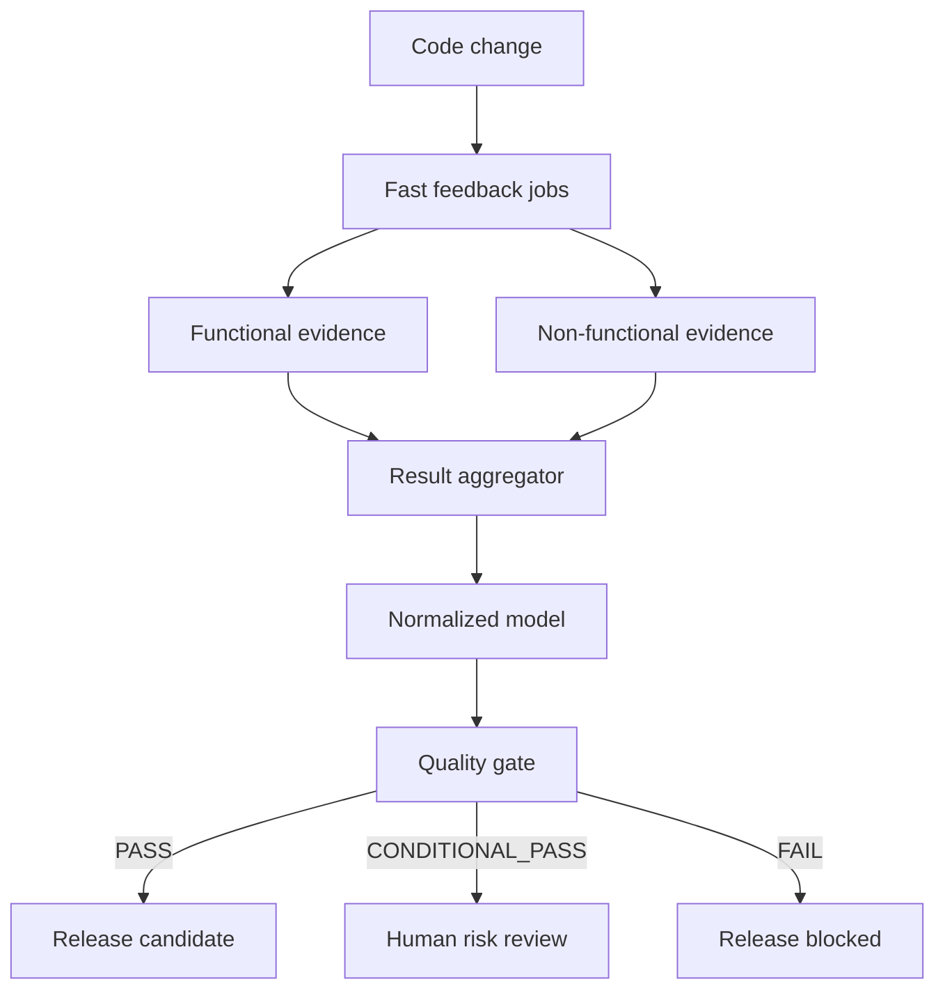

# Architecture

## Purpose

The architecture keeps evidence producers independent and release policy centralized. Tests and scanners own execution; parsers normalize their facts; policy decides whether those facts meet the current risk appetite.

## Boundaries

- `demo-app` owns API/UI behaviour and persistence.
- `tests` owns executable quality evidence, grouped by layer.
- `quality` owns policy schema, deterministic score, gate checks, and release decision.
- `scripts` owns transport concerns: parsing tool output, build metadata, HTML/JSON reports, health readiness, and changed-path selection.
- Workflows orchestrate but do not contain business thresholds.

Missing input is a first-class state. The aggregator records it, and a mandatory missing report fails the evidence gate. This avoids a false green caused by an interrupted scan or misconfigured artifact download.

## Scaling direction

At microservice scale, each service publishes versioned evidence to a central contract. A platform gate evaluates service-local policy plus portfolio constraints such as consumer compatibility, change risk, shared infrastructure, and production health. The same normalized model can be emitted to an evidence store and observability backend.
