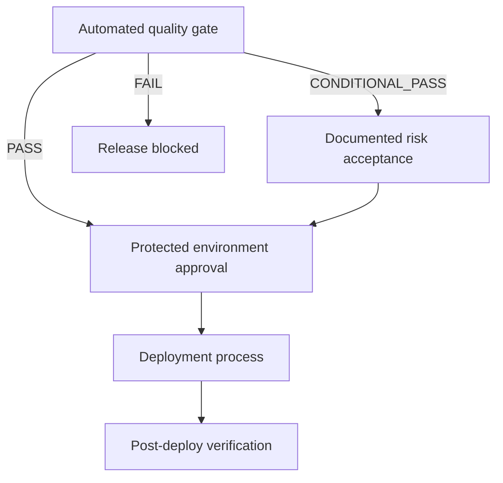

# Release governance

Automated evidence is a prerequisite for release consideration; it is not an uncontrolled production deployment.

## Controls

- Mandatory gates cannot be silently downgraded.
- Exceptions identify finding, rationale, owner, approver, compensating control, and expiry.
- Evidence is retained with commit, branch, environment, workflow run, and decision.
- Production environments use named approvers and least-privilege credentials.
- Rollback criteria and data migration reversibility are reviewed before approval.
- After deployment, health/SLO/canary evidence should confirm the release assumption.

Repeated waivers indicate policy or engineering debt and require review. Deleting evidence or permanently quarantining failures is not risk management.
